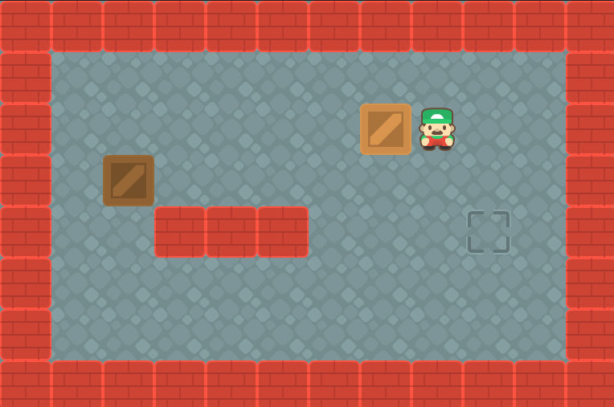

# Sokoban-Project
A demo project made with Godot.  
Now become open-source to everyone !  
(Learning from a course of timothyqiu on BiliBili)  

## Screenshot

## Description
Game engine: Godot  
Game engine version: 4.3 stable  

This Godot project contains assets from Kenney. 
Thanks to all authors and creators of them!

## How to contribute
### Clone the repo
Use `git clone https://github.com/program-jim/sokoban_proj` command or GitHub Desktop to clone this repository.
### Use Godot to open it
Use the right Godot version to open this Godot project.

## License
No license in this project ~~~ 
